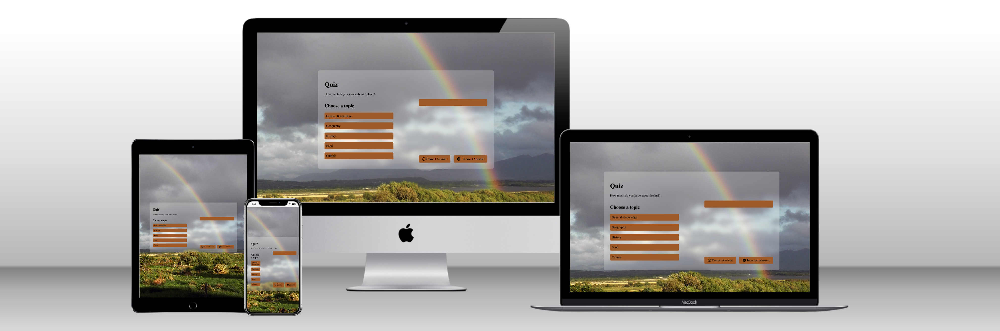
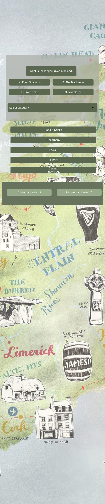
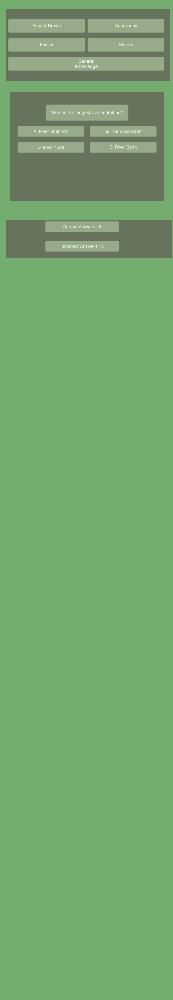
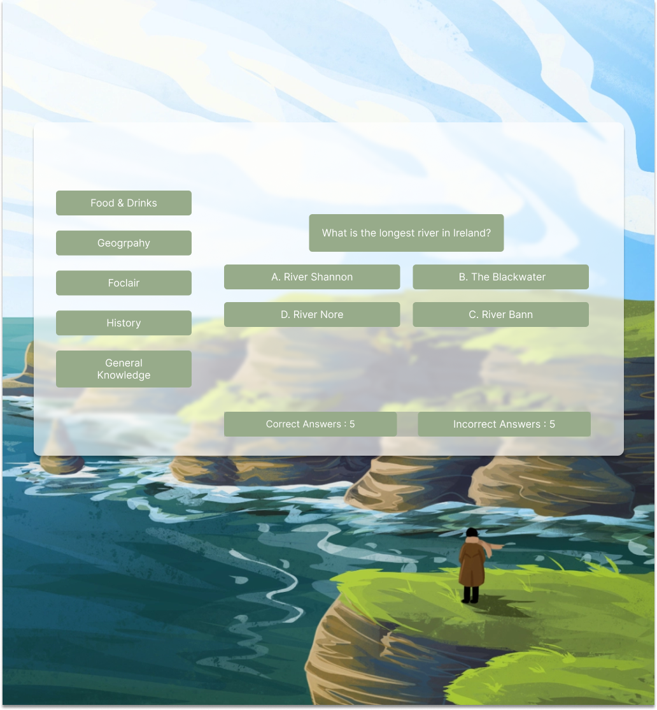

  

# Ireland Quiz

The Ireland Answers Quiz is a quiz which allows its users to test their knowledge about all this Irish. The quiz has five different categories which each have a verity of question to challenge the player. The categories are General Knowledge, Food & Drinks, Culture & Folklore, History and Geography.  The questions vary in terms of difficulty, some being easy and some designed to make you think.

Ireland Answers is suitable to be used by those who are well familiar with Ireland and those who travel to visit the emerald isle on a flying visit. This is due to its braid range of topics and well as difficulty. The quiz will also keep score of correct and incorrect answers, so it is perfect to challenge your friend and family. 

---

## **UX** 

### User stories

As a user I would like to the following:

Successfully implemented

- Play a quiz game with questions based on Ireland

Not yet implemented

- Reset questions when the user guesses the correct answer

### Design

 

#### Wireframes (Mobile)

Home page

---

#### Wireframes (Desktop) 

Home page

---

## **Features** 

### 1. Users can play a quiz game on questions based about Ireland

---

## **Future features**  

-  I would like to make the game more mobile friendly
-  Add some animations in the questions are clicked on and answered

 

[🔝 Back to Top](#ireland-quiz)

---

## **Technologies** 

### Web development

- 
  - [Code editor & version control](https://code.visualstudio.com)

- 
  - [Used as version control system](https://git-scm.com)

### Front-End Technologies

- 

  - Markup language.

- 
  - Used to add style to the markup.
- 
  - Used to show navigation menu on mobile devices.

### Figma

- Draw.io
  - [Used for designing mockups](https://www.figma.com/files/recent?fuid=1157743181286597394) 

 

[🔝 Back to Top](#ireland-quiz)

---

## Testing 

I checked the chrome developer tools for any error I may have gotten,

[🔝 Back to Top](#ireland-quiz)

---

## Deployment 

The project was deployed using GitHub pages and is live now [Ireland Quiz](https://michelle-io.github.io/ireland-quiz/) 

 

### Local Deployment 

Navigate or create a folder would like to clone the repository into & run the following command.

`git clone https://michelle-io.github.io/ireland-quiz/.git`

If you use Visual Studio Code you can add [Vite](https://marketplace.visualstudio.com/items?itemName=antfu.vite) from the market place for a better development experience.

 

---

### Remote Deployment 

There are many ways to deploy this project, however I chose GitHub pages.

#### Deploying using GitHub Pages

 To deploy to GitHub pages add the repository to your GitHub, next go to the pages option in settings & click deploy from branch button. The project will be live in a few minutes.

 

[🔝 Back to Top](#ireland-quiz)

---

## Credits 

### Acknowledgements 

- A big thank you to my brother Cian, he help to resolve some issues I have & provided feedback from my project.

 

[🔝 Back to Top](#ireland-quiz)